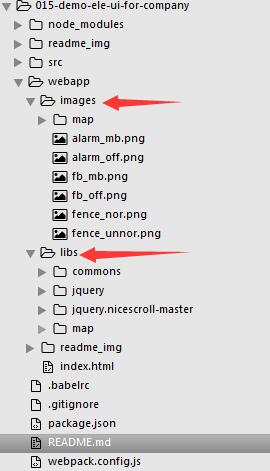
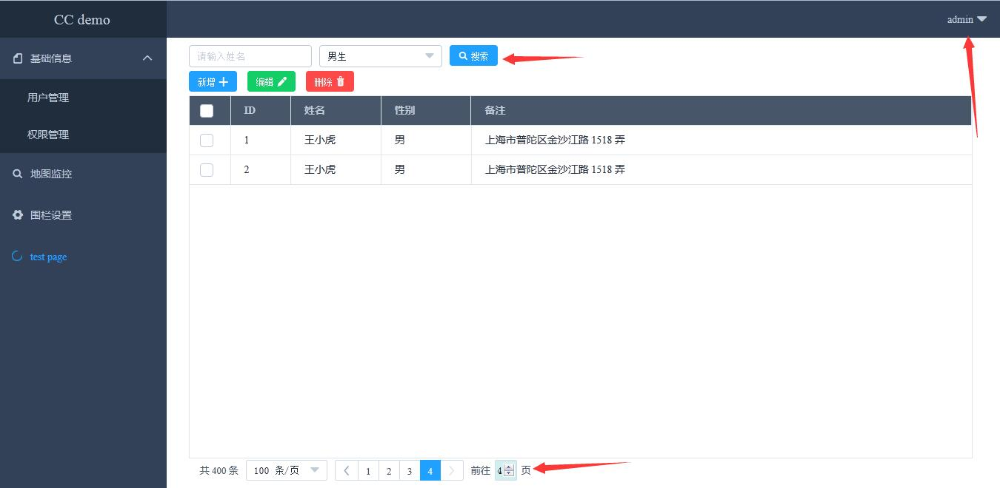
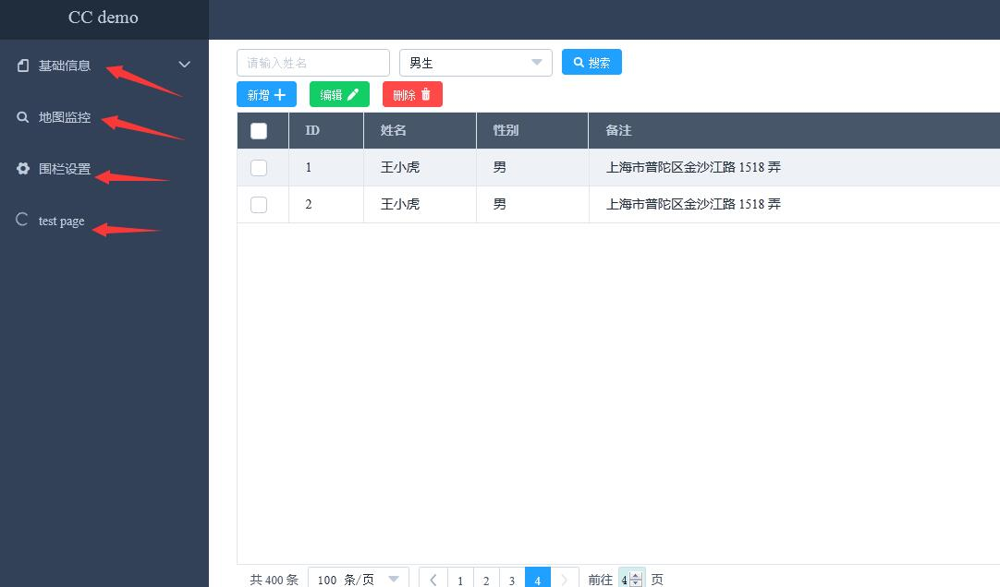
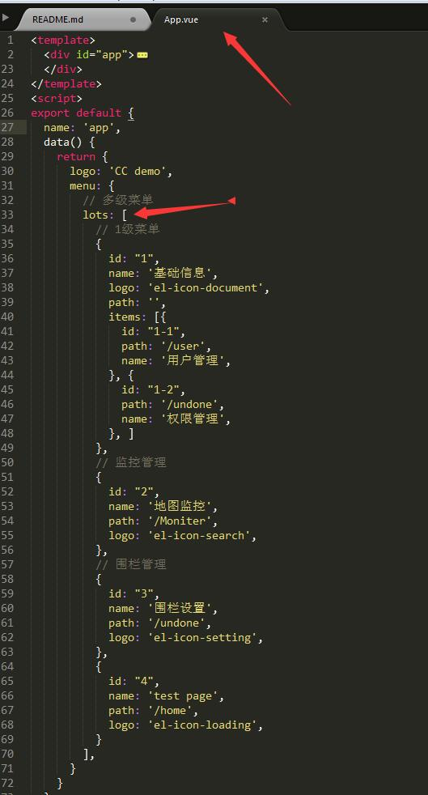
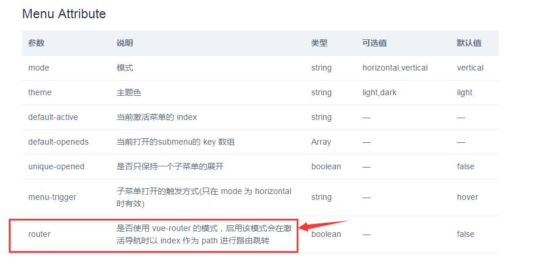
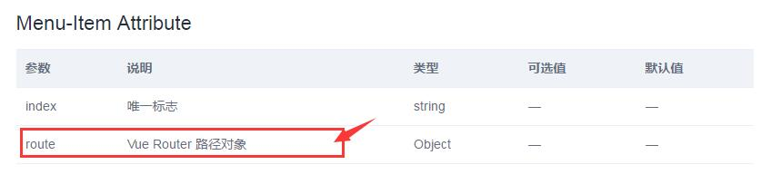

# 【vue】element-ui learning summary~c~

### 1.说明

* 该项目是学习完eleUI,写了个适合我们公司的项目结构的demo。
* 项目的输出都是在webapp文件夹下面。公共的脚本JS放在libs下面，图片放在images。



* 如何配置到webapp为开发环境的根目录及输出的目录配置看--[zc3hd/demo_webpack_v2.0_jq_kit_17-6-9](https://github.com/zc3hd/demo_webpack_v2.0_jq_kit_17-6-9)

* demo_webpack_v2.0_jq_kit_17-6-9是为了符合我公司的开发目录和结构的。该demo是全部是自己完成，配置了路由，按道理应该是各自负责各自的组件模块进行开发，然后统一打包。由于 demo_webpack_v2.0_jq_kit_17-6-9 这个配置方式对于各个开发自己组件比较适合，因此会出现下面的问题：
* 开发中发现的问题：如果团队使用vue进行开发，最终所有的组件的vue文件都会被打包到一个脚本下。相对来说加载时间会很长。目前想到的办法就是完全不用webpack进行对.vue文件打包，也就是不用vue-loader的（基础）版本进行开发，组件手动配置webpack对css和JS进行压缩和混淆就行。此处，该案例还是使用vue-loader进行打包。
* 该demo把前面写的地图的模块也融合到vue中了，具体还是采用地图面向对象写了一个模块，把构造函数实例化的挂载到moniter.vue组件上的属性，从而可以控制地图的实时数据请求的开启和关闭定时器的请求。
* demo用户列表增删改可用，地图监控可用。
* 用户模块，搜索不可用;右上角用户的信息的退出、编辑没有做。



### 2.eleUI 基础学习

* 可以使用BS进行布局。所以可以在index.html页面中引入bs的css文件，不要在组件中引入，不然每次编译都把大文件去编译了。

* ele_UI引入组件和样式，注册组件

``` js
import ElementUI from 'element-ui'
import 'element-ui/lib/theme-default/index.css'

Vue.use(ElementUI);
```

* 组件的使用,布局容器：eleui提供布局的组件，里面是该怎么写怎么写，有时候需要重新修改样式

``` html
<div id="home">
    <el-row>
        <el-col :span="24">
          <div class="grid-content bg-purple-dark" type="warning">asd</div>
        </el-col>
    </el-row>
</div>
```

* less在.vue文件中的使用：(注意scoped属性，有时候标识为scoped的话，组件中没有写的样式)

``` less
<style scoped lang="less">
#home {
  .grid-content.bg-purple-dark {
    border-radius: 4px;
    min-height: 36px;
    background-color: #58B7FF;
  }
  .el-date-editor.el-input {
    width: 100%;
  }
  .cc_form {
    margin-top: 20px;
  }
}
</style>
```

* 按需引入eleUI的组件

```
【1.安装】
npm install babel-plugin-component -D

【2.配置】将 .babelrc 修改为：
{
  "presets": [
    ["es2015", { "modules": false }]
  ],
  "plugins": [["component", [
    {
      "libraryName": "element-ui",
      "styleLibraryName": "theme-default"
    }
  ]]]
}

【3.使用】
import Vue from 'vue'
import { Button, Select } from 'element-ui'【es6】
import App from './App.vue'

Vue.component(Button.name, Button)
Vue.component(Select.name, Select)

// Vue.use(Button)
// Vue.use(Select)

【4.把需要提取的组件作为一个文件进行设置】
import Vue from 'vue'
import {Button,Radio,DatePicker..} from 'element-ui'

Vue.use(Button)

【5.引入组件的名称】
来源就是配置的theme-default文件夹下面的组件样式的名称

【6.ele组件的绑定】
eleUI组件可以添加原生事件的绑定。--@click='get'，组件的属性绑定也是按照vue的属性绑定！！！

【7.自定义组件的事件代理】
相对于上一条，如果自定义组件里包含eleUI的组件，在自定义组件的上面绑定事件为
@click.native = 'get'
里面的每个组件都可以代理触发父级组件所绑定的事件，
```

* 交互axios

``` 
npm install axios 【引入过来就是个函数，基于promise】

axios.post('/user', {
    firstName: 'Fred',
    lastName: 'Flintstone'
  })
  .then(function (response) {
    console.log(response);
  })
  .catch(function (error) {
    console.log(error);
  });

```

* 注意：es6语法方法内部的this指向是当前函数的作用域的this，bind()方法直接可以改变函数内部的this指向。

### 3.demo 实战

#### 3.1配置公用样式的less文件

```
@import '../css/commom/main.less';
```

#### 32.eleUI的导航使用

* 1.因为项目需求左侧为导航菜单，右侧为显示区，从后台返回来的左侧导航数据，需要指定路由。



* 2.确认了需求及需要返回的数据，再次确认该组件需要写在App.vue根组件中



* 3.【!】一级菜单和二级菜单的渲染，在不同的项上面使用了v-if="!val.path"和v-else

``` html
<el-menu id="lots" class="el-menu-vertical-demo" theme="dark" :router="true" :unique-opened='true' @open="handleOpen">
  <div v-for="(val,Index) in menu.lots" :key="Index">
    <el-submenu v-if="!val.path" :index="val.id">
      <template slot="title"><i :class="val.logo"></i>{{val.name}}</template>
      <el-menu-item v-for="(item_val,item_index) in val.items" :index="item_val.id" :route='{path:item_val.path}'>{{item_val.name}}</el-menu-item>
    </el-submenu>
    <el-menu-item v-else :index='val.id' :route='{path:val.path}'><i :class="val.logo"></i>{{val.name}}</el-menu-item>
  </div>
</el-menu>
```

* 4.【!】eleUI导航路由的配置

* 4.1 官方配置：【官方的说法，我自己理解就是开启router这个属性就可以在index上配置路由，也就是不开启这个属性的话，还是在每一项的route上进行路由】





* 4.2 不知道是我理解的不对还是哪写错了，按照官方的写法用不开启router这个功能，也就是在每一项的route上设置路由，就不行。最后我开启路由设置后，在每一项上设置index和route都可以了。我的天呐~~


* 5.【!】提取头部公共组件

```
【****其他组件】
import ccHeader from './com_compts/main_header.vue'
// 注意自定义组件的名称不要和已有组件进行冲突

export default {
  name: 'news',
  data() {
    return {
      msg: 'news'
    }
  },
  components:{
    ccHeader
  }
}
<style scoped lang="less">
@import '../css/commom/main.less';
#home {
  height: 100%;
  background-color: #ddd;
  【1.需要设置borderbox--弹性盒子】
  box-sizing: border-box;
  【2.less语法，可以在设置的基础上加10px】
  padding-top: @header_h+10px;
  【3.设置竖向滚动条】
  overflow-x:auto; 
  >.cc_form {
    padding-left: 30px;
    padding-right: 50px;
  }
}
</style>


【****头部组件】
<template>
  <div id="main_header">
  </div>
</template>
<style scoped lang="less">
@import '../../css/commom/main.less';
#main_header {
  【一旦位置固定的话，宽度就是直接取屏幕的宽了。因为该组件上面的父级选择的20列的宽，宽度83.3333%，所以下面为83.3333%】
  width: 83.3333333%;
  min-height: @header_h;
  【这里需要设置固定定位】
  position: fixed;
  top:0;
  【层级需要设置，不然会和其他组件的其他eleUI组件叠加在一起】
  z-index: 10;
}
</style>
```

* 6.【!】组件中的定时器，实时请求
* 6.1 Home.vue组件中，编译完成后开启进度条,切换路由时，就是销毁这个组件视图，要在beforeDestroy清除定时器。地图的模块函数用面向对象写在单独的模块中，在vue中只不过是使用。

```
  mounted() {
    this.timer = setInterval(function() {
      if (this.percentage == 100) {
        this.status = 'success';
        this.percentage = 0;
      }
      if (this.percentage <= 30) {
        this.status = 'success';
      } else {
        this.status = 'exception';
      }
      this.percentage++
    }.bind(this), 1000);

  },
  beforeDestroy: function() {
    clearInterval(this.timer);
  },
```

* 6.1 Moniter.vue组件中，编译完成后执行地图的模块init()函数。

```
<script>
export default {
  name: 'map',
  data() {
    return {
      // 一会去挂载实例化的对象
      module: null,
    }
  },
  methods: {
    // 模块的数据初始化
    argument_init: function() {
      // --------------------------------宏观模式的围栏
      // 收集围栏的所有的点---为了最优视角
      this.module.f_big_arr = [];
      // 宏观模式的循环时间
      this.module.f_big_timer = null;
      // 海星围栏的收集
      this.module.f_big_dom_arr = [];
      // 围栏最优一次
      this.module.f_view = true;
      // 宏观围栏mass的大小
      this.module.f_size = null;
      // mass加载 第一次进行加载，第二次注入数据
      this.module.f_first_load = true;
      this.module.f_small_timer = null;

      // ---------------------------------自行车
      // 海星的收集
      this.module.b_dom_arr = [];
      // 自行车的定时器
      this.module.b_timer = null;
      // 宏观围栏mass的大小
      this.module.b_size = null;
      // mass加载 第一次进行加载，第二次注入数据
      this.module.b_first_load = true;

      // ---------------------------------开关
      // fence 点击开关--没有点击
      this.module.f_mass_key = false;

      //这个参数证明围栏已经到了3-19级--即使发出请求也不进行打点
      this.module.f_wheel_key = false;

      // 微观数据启动标记---默认没有启动
      this.module.f_small_key = false;
    },
    // 清除所有的定时器
    // 该处是地图的模块写的不够完善，所以不能进行更好的清除地图的定时器，和vue切换路由是没有关系的
    clear_init:function () {
      var me = this.module;
      clearTimeout(me.f_big_timer);
      clearTimeout(me.b_timer);
    },
  },
  // 编译完成后开启实时请求
  mounted() {
    this.module = new diyBdMap({
      id: 'container'
    });
    this.argument_init();
    this.module.init();
  },
  // 切换路由时关闭定时器。
  beforeDestroy: function() {
    this.clear_init();
  },
}
</script>
```

* 7.其他
* 7.1 eleUI信息提醒：this.$message('click on item ' + ...);

```
【下拉菜单】
<el-dropdown @command="handleCommand">
  <span class="el-dropdown-link">
  {{name}}<i class="el-icon-caret-bottom el-icon--right"></i>
  </span>
  <el-dropdown-menu slot="dropdown" class='header_user_info'>
    <el-dropdown-item command="1">信息编辑</el-dropdown-item>
    <el-dropdown-item command="2">密码修改</el-dropdown-item>
    <el-dropdown-item command="3">退出</el-dropdown-item>
  </el-dropdown-menu>
</el-dropdown>

methods: {
  // 会自动找到 command 属性
  handleCommand(command) {
    【信息提醒】
    this.$message('click on item ' + command);
  }
}
```

* 7.2 JQ插件--滚动条的优化

```
在页面主页引入文件
<script src='/libs/jquery/jquery.js'></script>
<script src='/libs/jquery.nicescroll-master/dist/jquery.nicescroll.js'></script>

使用：
$("#home").niceScroll({
  cursorwidth: 12,
  cursoropacitymin: 0.4,
  cursorcolor: '#6e8cb6',
  cursorborder: 'none',
  cursorborderradius: 4,
  autohidemode: 'leave'
});
```
